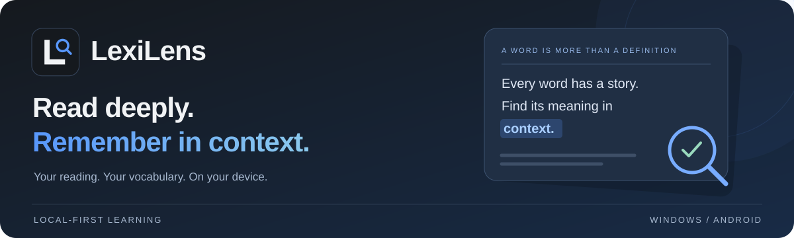

<div align="center">



# LexiLens

**让每一个词，回到它的语境里。**

本机英语精读与语境词句本 · 从图片导入，到阅读理解，再到词句复习


[](LICENSE)

[功能亮点](#features) · [开始使用](#getting-started) · [开发构建](#development) · [更新日志](docs/CHANGELOG.md) · [验证记录](docs/VALIDATION.md)

</div>

---

LexiLens 把图片里的英文材料变成可精读、可查词、可积累的学习项目。点击单词或拖选短语获取语境解释，收藏时保留**原词形、原句和出处**，让复习有上下文可循。

> [!IMPORTANT]
> 当前为 **0.1.3 开发测试版**，Windows 与 Android 尚未完成首版验收。测试包与设备验证进度见 [验证记录](docs/VALIDATION.md)，请使用独立测试目录。下列功能已接入代码，不代表在每个平台均已通过验收。

<a id="features"></a>

## ✨ 功能亮点

| | 能做什么 |
| :--- | :--- |
| **📄 图片变成阅读材料** | 导入 JPG / PNG，多张图片按顺序联合转写，整理文章、自然段、跨页续文与题目；核对后再应用。 |
| **🔎 在原句中理解词义** | 点击单词、拖选短语，查看语境解释、词性与简短释义；支持原句高亮和词句发音。 |
| **📚 收藏带着上下文** | 保留原词形、原句与出处，项目词句本和全局词句本共享记录，支持固定批次复习。 |
| **💡 从段落读到全文** | 提供文章 / 项目总结、多段分析和自由追问；篇末选择题可主动请求解答，查看中文理由与原文依据。 |
| **↩️ 整理过程可回看** | 保留原图、处理副本与正文版本，支持历史整理恢复、回收站、手动备份及导出。 |
| **💾 学习资料留在本机** | 阅读、已有释义和词句复习可离线使用；新识别和解释需要联网及个人 DeepSeek Key。 |

<a id="getting-started"></a>

## 🚀 开始一次精读

**导入图片 → 联合识别 → 核对正文 → 划词精读 → 收藏复习**

1. **准备资料库**：启动原生应用，选择本机资料目录；首次使用按引导配置个人 DeepSeek Key。
2. **导入阅读材料**：新建项目，添加 JPG / PNG 并确认页序，在「上传与页面」进行联合识别。
3. **核对并应用**：对照原图检查转写与文章组织，确认后一次应用；旧整理可从「历史整理」恢复。
4. **开始精读**：在「精读」目录连续阅读全部文章，或打开单篇；点击单词、拖选短语，按需请求总结与题目解答。
5. **积累与复习**：收藏有价值的词句，在项目或全局词句本复习，定期导出备份。

> [!TIP]
> 已有项目升级至 0.1.3 后，可在「上传与页面」执行「全部图片联合识别」，核对并应用新的文章组织。原图无需重新上传，旧项目不会自动重写。

## 🆕 0.1.3 更新

| 更新 | 阅读体验 |
| :--- | :--- |
| **整组联合转写** | 多图进入同一个请求，再通读完整文字，统一中文标题、自然段、跨页续文和题目归属。 |
| **核对后统一应用** | 正文以原文块引用组织，检查完整覆盖、重复归属和漏块；格式或结构不合格时最多复核一次，保留原图与返回原稿。 |
| **可折叠的精读目录** | 父项串联全部文章及各自篇末题目，子项保留单篇阅读入口。 |
| **带依据的题目解答** | 主动点击才请求模型，展示答案、中文理由及经校验的原文依据，支持加载反馈、取消与结果缓存。 |

完整变更见 [更新日志](docs/CHANGELOG.md)。

<details>
<summary><strong>展开更多交互细节</strong></summary>

- **查词反馈**：等待和加载状态清晰可见；同一有效语境优先复用第一条成功解释，显式刷新才重新请求。
- **阅读工具栏**：底部图标栏居中，按宽度收纳；悬停显示名称，已存总结、设置和备份始终在更多菜单中。
- **材料管理**：图片列表展示文件名、页序和识别状态，支持拖入提示；原文区分正文与非正文，只有正文参与精读分段和总结。
- **项目导航**：固定提供上传、非文章部分和总结入口。选择题跟随所属文章，其余非正文分区折叠；关闭快捷访问后仍可从首页打开项目。
- **总结阅读**：当前文章和项目全部总结分开保存，呈现中文概览、分篇要点及折叠引用。格式或引用无效时最多校正一次，失败则保留可读草稿并标注待核对。
- **启动体验**：新项目默认使用本地日期，空名称同样使用日期；首次无 Key 时显示配置引导，Windows 测试包启动不显示控制台。

</details>

## 🔐 数据与隐私

### 本机保存，按需联网

| 项目 | 保存与使用方式 |
| :--- | :--- |
| **Windows 资料** | 所选资料目录包含 SQLite 工作库和 `assets` 原图副本，也可选择程序目录内的 `LexiLensData`。 |
| **Android 资料** | 可选本机原图目录，工作数据库仍在应用私有目录；也可使用应用内部资料目录。APK 安装目录只读。 |
| **API Key** | Windows 使用当前用户 DPAPI，Android 使用 Keystore；Key 不进入资料库、普通备份或日志。 |
| **模型请求** | 原生代码向 DeepSeek 官方 HTTPS 接口发送任务所需的图片或文本。默认 Flash，OCR 始终使用 Flash；Pro 仅由用户主动选择用于文本任务，无自动模型升级。 |
| **离线使用** | 阅读、查看已有释义和词句复习可离线进行；新的识别、解释等模型任务需要联网。 |

无登录、云保存、自动同步或遥测。当前不支持 PDF 导入和自动答题；问题需用户核对后主动请求解答，思维导图不在本期。

### 备份与迁移

- **完整备份**：包含正文、版本、收藏、模型结果及引用到的图像。
- **轻量备份**：不含图像，适合只保留文字与学习记录。
- **恢复方式**：导入使用新的资料 ID，不覆盖原库；当前单包上限 **128 MiB**，较大资料可分项目导出。

> [!WARNING]
> Android 卸载前必须通过系统保存窗口导出完整备份。模型转写可能出错，请核对原图；结构或引用校验通过不代表内容必然正确。

<a id="development"></a>

## 🛠️ 开发与构建

共享前端使用 **TypeScript + Vite**，原生端基于 **Tauri 2 + Rust**，数据使用 **SQLite** 保存。依赖版本由锁文件固定。

### 环境准备

| 范围 | 所需工具 |
| :--- | :--- |
| **基础工具链** | Node.js、Rust stable |
| **Windows** | MSVC C++ 构建工具、Windows SDK、WebView2 |
| **Android** | JDK 21、SDK 36、NDK 29 和相应 Rust targets |

### 安装与运行

```powershell
git clone https://github.com/HelloWorld-slc/LexiLens.git
cd LexiLens
npm ci

# 启动原生桌面开发环境
npm run tauri -- dev
```

`npm run dev` 可用于检查网页布局；浏览器模式不具备原生保存或模型能力。

### 验证与打包

```powershell
# 前端逻辑测试与生产构建
npm test
npm run build

# 完整验证：前端构建、JavaScript 测试与 Rust 测试
./scripts/build.ps1 -Target test

# 生成开发测试包
./scripts/build.ps1 -Target windows
./scripts/build.ps1 -Target android
```

<details>
<summary><strong>构建选项与产物位置</strong></summary>

- 脚本默认生成 **debug 测试包**，优先使用本地 `.tools` 工具链，也支持已配置的系统工具链。
- Windows 可增加 `-Release`；Android release 还需配置自己的签名，签名文件不可提交。
- 首次 Android 构建会自动生成工程，并关闭 Android 自动备份。
- Windows debug 安装包：`src-tauri/target/debug/bundle/nsis/`。
- Android APK：`src-tauri/gen/android/app/build/outputs/apk/`。

Android 依赖许可补充见 [ANDROID_DEPENDENCIES.md](docs/ANDROID_DEPENDENCIES.md)，平台验证边界见 [VALIDATION.md](docs/VALIDATION.md)。

</details>

### 源码导航

| 路径 | 内容 |
| :--- | :--- |
| [`src/core.mjs`](src/core.mjs) | 版本引用、词句收藏、复习、取消状态和备份副本映射 |
| [`src/main.ts`](src/main.ts) | 共享响应式界面与任务流程 |
| [`src-tauri/src/`](src-tauri/src/) | SQLite、资产、官方模型接口、备份、DPAPI 和 Windows 语音 |
| [`plugins/tauri-plugin-platform/`](plugins/tauri-plugin-platform/) | Android 本机目录、Keystore、语音与相机 |
| [`tests/`](tests/) | 可重复的逻辑验证，不携带私人学习材料或凭据 |

## 📄 许可证

本项目采用 [MIT License](LICENSE)，依赖许可见 [THIRD_PARTY_NOTICES.md](THIRD_PARTY_NOTICES.md)。用户测试图片、需求问卷、数据库、原始 API 响应和本地配置不属于公开源码。

---

<div align="center">

**LexiLens · 在语境里理解，在阅读中积累。**

[反馈问题](https://github.com/HelloWorld-slc/LexiLens/issues) · [查看更新](docs/CHANGELOG.md) · [了解验证进度](docs/VALIDATION.md)

</div>
